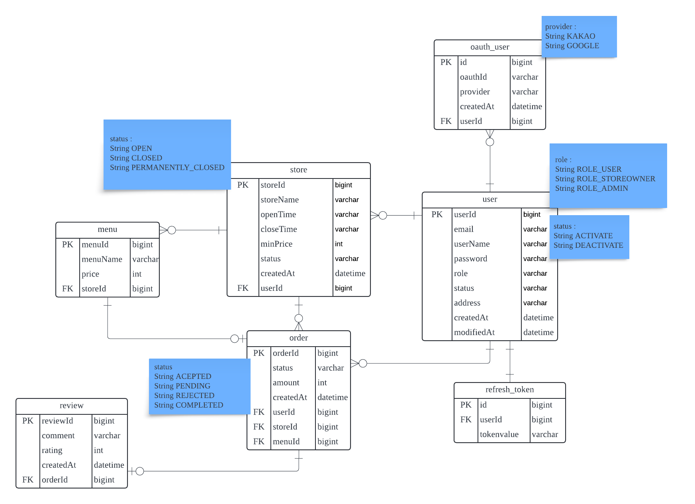

## 아웃소싱  프로젝트 : 토마토 배달 앱

<br>

### 프로젝트 소개
- 토마토 앱은 야채 가게 사장님이 가게를 등록하고, 메뉴를 등록하고 사용자는 해당 메뉴를 주문하고 배달받아 리뷰를 작성 할 수 있는 배달 어플리케이션입니다.
- JWT를 이용하여 로그인한 회원에 대한 인증/인가를 구현하였습니다.
- Oauth2.0 카카오, 구글 로그인 서비스를 구현하였습니다.
- AOP를 통하여 로그인한 사용자의 정보를 읽어들여서 각 API 호출 시 권한에 맞는 사용자만 사용 할 수 있게 구현하였습니다.
- 리프레시 토큰을 사용하여, 엑세스 토큰이 만료 될 시 재발급 받을 수 있게 하여 사용성을 개선하였습니다.


<br>

### 프로젝트 필수 조건
- 유저
  - 사용자 아이디는 이메일 형식이어야 합니다.
  - 비밀번호는 `Bcrypt`로 인코딩합니다.
    - 회원가입시 일반 유저(USER) 또는 사장님(OWNER)으로 가입할 수 있습니다.
    - 권한에 따라 사용할 수 있는 기능이 나뉘어집니다.
  - 탈퇴 처리 시 `비밀번호`를 확인한 후 일치할 때 탈퇴 처리합니다.
  - 탈퇴한 사용자의 아이디는 재사용할 수 없고, 복구할 수 없습니다. (SOFT DELETE)

- 가게
  - 가게는 오픈 및 마감 시간, 최소 금액이 있습니다.
  - 사장님 권한을 가진 유저만 가게를  만들 수 있습니다.
  - 고객은 가게명으로 가게를 여러 건 찾아볼 수 있습니다.
  - 가게 단건 조회 시 등록된 메뉴 목록도 함께 볼 수 있습니다.
  - 폐업시, 가게의 상태만 폐업 상태로 변경됩니다.

- 메뉴
  - 메뉴 생성, 수정은 사장님만 할 수 있습니다.
  - 사장님은 본인 가게에만 메뉴를 등록할 수 있습니다.
  - 단독으로 조회할 수는 없으며, 가게 조회 시 함께 조회됩니다.
  - 본인 가게의 메뉴만 삭제할 수 있습니다.

- 주문
  - 고객은 메뉴를 주문할 수 있습니다.
  - 각 주문에는 하나의 메뉴만 주문할 수 있습니다.
  - 사장님은 주문을 수락할 수 있으며, 배달이 완료될 때까지의 모든 상태를 순서대로 변경 합니다.

- 리뷰
  - 고객은 주문 건에 대해 리뷰를 작성할 수 있습니다.
  - 리뷰는 단건 조회할 수 없습니다.

### 도전 기능
- Oauth 2.0 로그인(카카오, 구글) 구현
  - 로그인 시 토큰 발급 구현
  - 최초 로그인 시 Oauth로 받아온 정보를 통하여 회원가입
  - 기존 동일 이메일로 된 회원이 있을 시 회원가입을 진행하지 않고 로그인만 수행

- 리프레시 토큰
  - 기존에 헤더에 발급해준 엑세스 토큰이 만료 되었을 시 리프레시 토큰을 검증하여 유효성이 확인된다면 엑세스 토큰을 발급
  - 리프레시 토큰도 만료되었다면 엑세스 토큰을 발급해주지 않음

- AOP
  - Spring Boot AOP를 활용하여 회원의 권한별로 API를 접근할 수 있도록 처리함
  - 로그를 남겨 해당 유저가 API 접근에 대한 기록을 보관

- Resolver
  - JWT에서 유저정보를 가져올 때 반복적으로 작성해야하는 코드를 제거하기 위하여 `HandlerMethodArgumentResolver`를 이용하여 중복 코드를 제거

<br>

### 프로젝트 실행법
1. application.properties에서 mysql 설정에 맞게 아이디 비밀번호 설정
2. postman으로 api명세서의 요청 형식에 맞춰서 요청 (root폴더에 있는 맛도리 토마토.postman_collection.json로 설정)
3. 인증 필요 시 Header에 Authorization 부분에 로그인 후 응답받아 사용, 이후 Header에 함께 요청
4. 엑세스 토큰이 만료 시, 쿠키 저장소에 들어있는 `refresh_token`을 사용.

<br>

### 사용한 기술 스택
- Java, Spring Boot
- MySQL


<br>

### 주요 라이브러리
- Lombok: 보일러플레이트 코드를 줄이기 위한 라이브러리. 자동으로 getter, setter, 생성자 등을 생성.
- JPA: 자바에서 ORM을 위한 표준 API로 DB와 상호작용을 쉽게 도와줌
- Spring Web: 웹 애플리케이션을 위한 모듈로, RESTful API 개발을 지원
- MySQL Driver: MySQL DB와 JAVA APP과의 연결을 지원하는 드라이버
- validation: 객체의 필드에 대한 유효성 검사를 수행
- JWT: 헤더에 담을 토큰 인증 방식

<br>

### 프로젝트 구조
```
src
└── main
└── java
└── com
└── sparta
└── realtomatoapp
├── auth
│   ├── config
│   ├── controller
│   ├── dto
│   ├── entity
│   ├── repository
│   └── service
├── common
│   ├── config
│   ├── dto
│   └── entity
├── menu
├── order
├── review
├── security
│   ├── config
│   ├── exception
│   ├── filter
│   ├── util
│   └── Authorized (annotation)
├── store
│   ├── controller
│   ├── dto
│   ├── entity
│   ├── repository
│   └── service
└── user
└── RealtomatoappApplication (main application class)
```

<br>

### API 명세
- [API 명세서 링크](https://documenter.getpostman.com/view/38711511/2sAY518fEL)

<br>

### ERD 다이어그램
<br>
